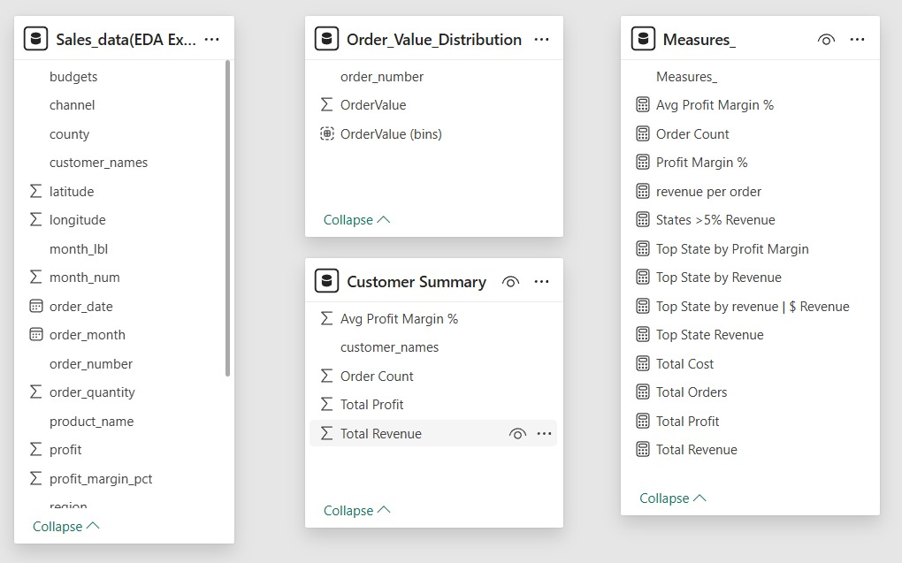
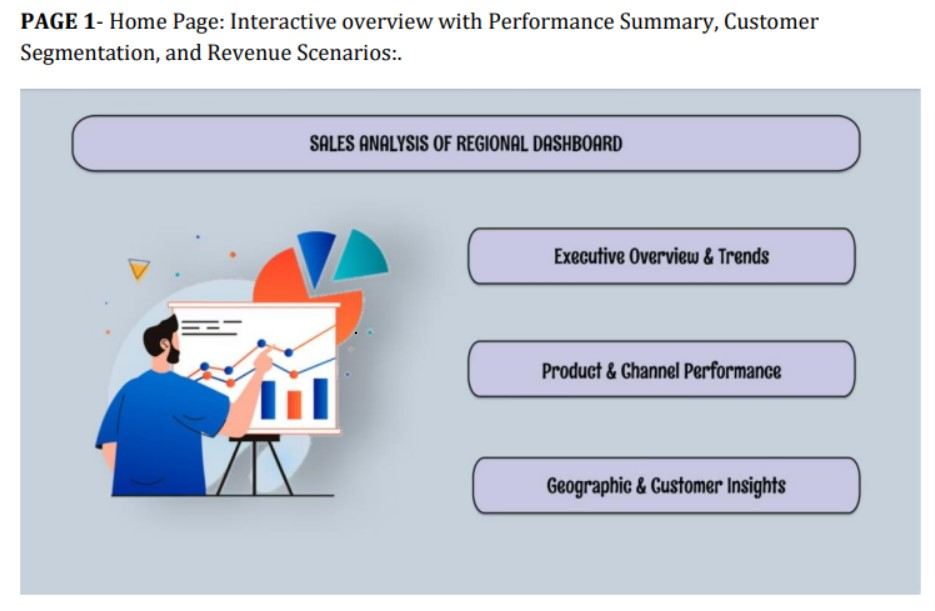
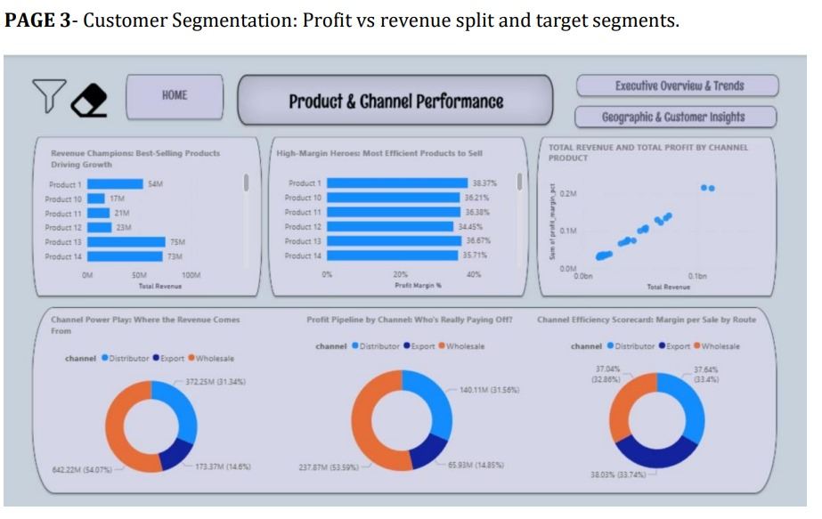
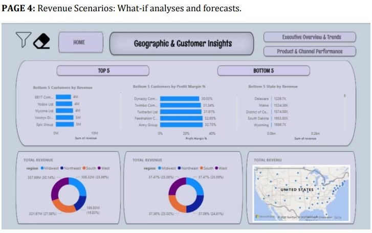

---
# 🛒 Sales Analysis of Customers
---

## 📘 Project Overview

This project analyzes **regional sales performance** to identify key revenue drivers, product trends, and profit variations.  
It combines **Python-based Exploratory Data Analysis (EDA)** with an interactive **Power BI dashboard** to derive actionable business insights.

The primary objective is to support **data-driven strategic decision-making** by uncovering how customer segments, products, and channels influence sales growth and profitability.

> 🧾 Note: All datasets are **synthetic and generated for educational purposes**.

---

## 🧩 Project Structure
- **Data Preparation (Python)** – Cleaned and preprocessed data using pandas & NumPy.  
- **EDA (Python)** – Performed trend, channel, and customer analysis through statistical and visual exploration.  
- **Power BI Dashboard** – Designed a 4-page interactive dashboard for key performance tracking.  
- **Business Insights** – Identified top-performing regions, customers, and improvement areas.  
- **Documentation** – Compiled all insights into professional PDF and presentation reports.  

---

## 🛠️ Tech Stack
| Tool / Technology | Purpose |
|-------------------|----------|
| **Python (Pandas, Matplotlib, Seaborn)** | Data cleaning & EDA |
| **Power BI** | KPI dashboards & visual analytics |
| **Excel** | Data preparation & export |
| **Git & GitHub** | Version control & project publishing |

---

## 🧱 Dataset Summary
| Table | Description |
|--------|-------------|
| **Sales** | Transaction-level order data (product, quantity, revenue, profit) |
| **Products** | Product details, category, and price |
| **Customers** | Customer profiles, segments, and channels |
| **Regions** | Regional mapping of customer sales |
| **Budgets** | Financial targets for year-on-year comparison |

**Preprocessing Steps:**
- Merged datasets on `product_id`, `customer_id`, and `region_id`.  
- Removed duplicates and standardized naming conventions.  
- Calculated derived metrics: `profit = revenue - cost` and `profit_margin_pct = (profit / revenue) * 100`.  
- Verified completeness and accuracy post-merging.

---

## 📊 Business Problems Solved
1. Identify **top-performing regions and customers**.  
2. Track **seasonal trends and monthly revenue cycles**.  
3. Evaluate **channel-wise performance** (Wholesale, Distributor, Export).  
4. Analyze **product profitability** and SKU concentration.  
5. Segment customers by **revenue vs profit margin**.  
6. Measure **average order value (AOV)** and customer clusters.  
7. Derive **recommendations** for product mix and pricing optimization.  

---

## 💻 Sample SQL 

```sql
-- 💰 Total Sales by Channel
SELECT channel, ROUND(SUM(revenue), 2) AS total_revenue
FROM sales
GROUP BY channel
ORDER BY total_revenue DESC;
```

---

## 🖼️ Visual Insights

🧮 Table Overview
<p align="center">  </p>

📊 Power BI Dashboards

The DASHBOARD folder contains 4 interactive visual snapshots illustrating:
Revenue Breakdown (by Gender, Age, Region)
Discount Impact vs Spending
Customer Segmentation (Loyal, New, Returning)
Top Products & Shipping Insights

<p align="center">   </p> <p align="center">   </p>

---

## 🧠 Key Insights

Pronounced Seasonality – Peaks in May–June; troughs in January and April.
Product Concentration – Products #26 & #25 drive 25% of revenue.
Channel Efficiency – Wholesale accounts for 54% of volume; Export offers ~38% higher margins.
Regional Performance – West dominates sales; Northeast needs focused growth.
Customer Mix – Aibox Company and State Ltd contribute the highest revenue shares.

---

## 💡 Business Recommendations

Launch seasonal promotions to smooth revenue volatility.
Optimize SKU mix by doubling down on top performers.
Incentivize Export channels to maximize margins.
Expand regional investment in the Northeast.
Track low-margin high-volume orders for renegotiation.

---

## 📄 Documentation

Comprehensive reports and dashboards are included:

File	Description
📘 REPORT — Sales Analysis of Customers.pdf
	Complete project report with insights, visuals, and recommendations
📊 PPT — Sales Analysis Presentation.pptx
	Executive presentation summarizing dashboard findings
🧾 Regional_Sales_Analysis.ipynb
	Python notebook for EDA and data cleaning
📈 Sales Dashboard.pbix
	Power BI dashboard file
📊 Sales_data(EDA Exported).csv
	Final cleaned dataset

All files are linked directly for review or download via GitHub.

---

## 🧾 Conclusion

This project demonstrates how data analytics and BI tools can transform raw sales data into actionable insights.
It highlights a full pipeline — from data wrangling in Python to insightful Power BI dashboards — reflecting practical analytical expertise for real-world business cases.

---

## ⚠️ Disclaimer

All data and visuals are AI-generated and educational.
This repository is designed for learning, demonstration, and portfolio showcase purposes only.

---

## 👨‍💻 Author

Mukesh Gopi Nandh
📧 mukeshudatha7@gmail.com

🌐 Connect with Me:

<p align="left"> <a href="https://github.com/Mukeshgn" target="_blank">  </a> <a href="https://www.linkedin.com/in/mukesh-gopi-nandh" target="_blank">  </a> </p>
